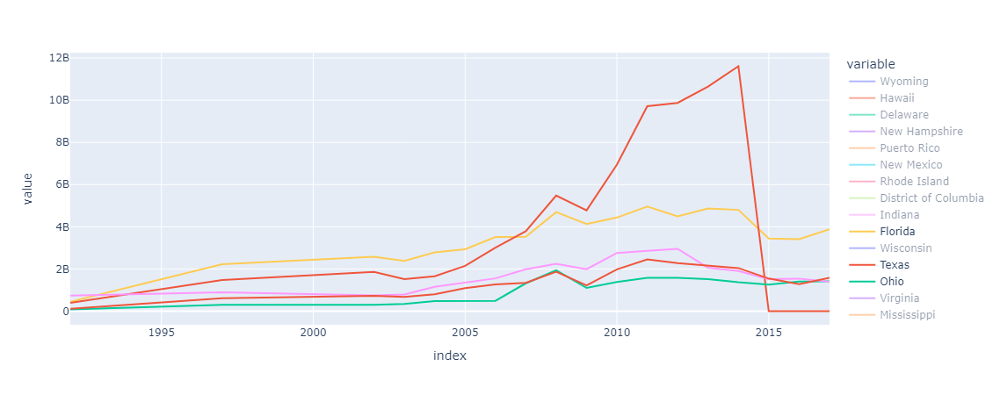
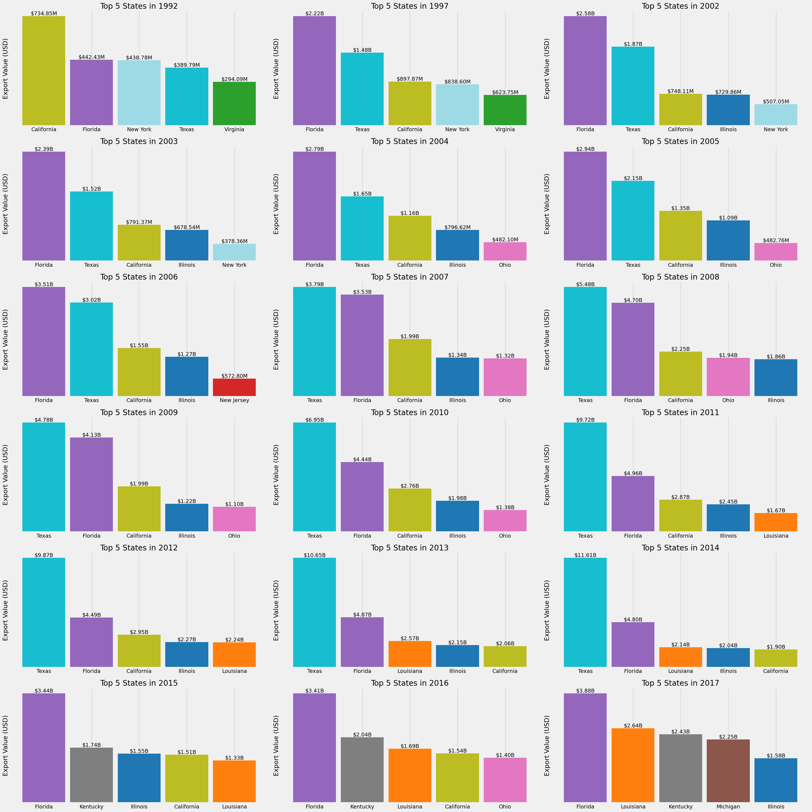
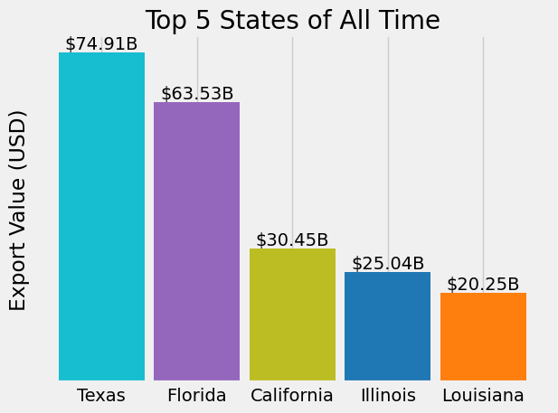

# Brazil Exports Analysis

This project retrieves export data to Brazil from FRED (Federal Reserve Economic Data) and analyzes the top 5 american states that export to Brazil each year.







## Steps:

1. **Data Retrieval**:

   - The data is retrieved using the FRED API, with the specific search term "Value of Exports to Brazil from".
   - The data includes state-wise exports to Brazil for multiple years.

2. **Data Preprocessing**:

   - The results are cleaned by removing rows where all values are NaN.
   - The index is updated to represent the year.

3. **Visualization**:

   - **Top 5 Exporters by Year**: For each year, the top 5 states are plotted in subplots as a bar chart. Each bar represents a state, and the height of the bar is the export value.
   - **Top 5 Exporters of All Time**: A bar plot is generated showing the states with the highest total export value to Brazil across all years.

## Requirements:

- pandas
- plotly
- matplotlib
- fredapi

You can install these dependencies with the following:

```
pip install -r requirements.txt
```

## Running the Code:

1. Fetch the data from FRED using the API key.
2. Preprocess and clean the data.
3. Visualize the results using **matplotlib** and **plotly** for line plots and bar plots.

## Notes:

- Ensure you replace the `api_key` variable with your own key from FRED API.
- The code uses **matplotlib** to generate subplots and bar charts, and **plotly** to create line charts.
